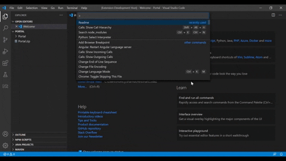

# Readme Template Generator for VS Code

A VS code extension to generate a default editable template and generate instant preview in the editor.

## Getting Started

## Preview



### Dependencies
* VS Code
* Node.js and npm
* Typescript

### Installing
* Install node_modules
```
npm run install
```
### Executing program
* Generate VS Code debugging launch.json file refer https://code.visualstudio.com/docs/nodejs/nodejs-debugging

## Help
Any advise for common problems or issues.
```
command to run if program contains helper info
```
## Authors
Contributors names and contact info
ex. Dominique Pizzie  
ex. [@DomPizzie](https://twitter.com/dompizzie)
## Version History
* 0.2
* Various bug fixes and optimizations
* See [commit change]() or See [release history]()
* 0.1
* Initial Release
